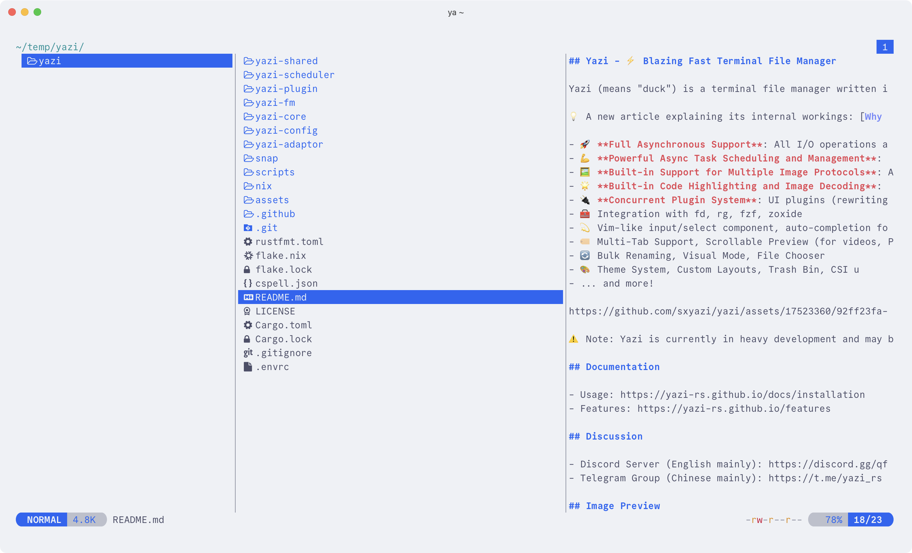
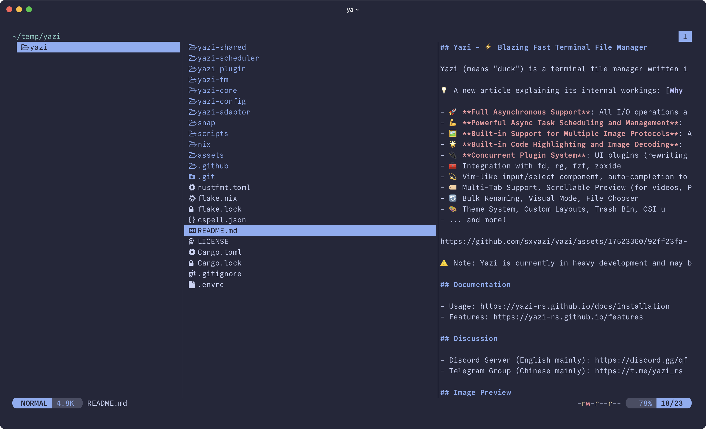
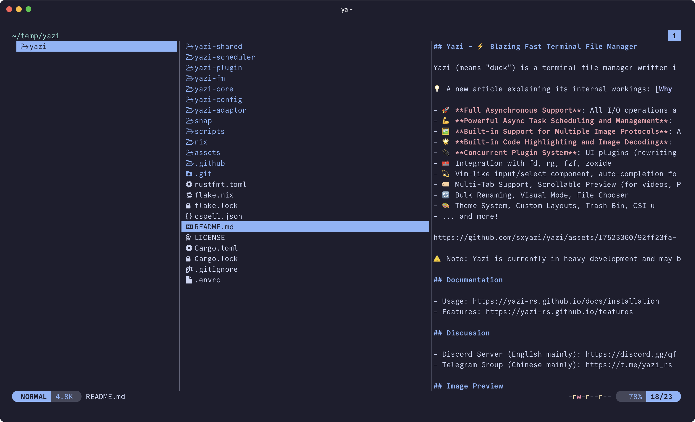

<h3 align="center">
	 
	
	Catppuccin for <a href="https://yazi-rs.github.io">Yazi</a>
	
</h3>

	
	
	

	

## Previews

🌻 Latte

🪴 Frappé

🌺 Macchiato

🌿 Mocha

## Usage

1. Copy the theme file of your choice from `themes/` to your [Yazi configuration directory](https://yazi-rs.github.io/docs/configuration/overview) with the filename `theme.toml`.
2. For Catppuccin-themed syntax highlighting in the preview pane:
   - Download the `.tmTheme` file of your choice from [catppuccin/bat](https://github.com/catppuccin/bat).
   - Replace the path of `syntect_theme` (line 32) with the path of your downloaded `.tmTheme` file.

## Contributing

To contribute to this port you will need the following dependencies installed:

- [Whiskers](https://github.com/catppuccin/whiskers)
- [Deno](https://docs.deno.com/runtime/manual/getting_started/installation)

Edit `yazi.tera` to make changes to the theme. Run `just build` to build the output themes in `themes/`.

To update the icons data, you will additionally need [Lua](https://lua.org/start.html), [LuaRocks](https://luarocks.org/), and the [`dkjson` LuaRocks module](https://luarocks.org/modules/dhkolf/dkjson). Run `just icons` to fetch and process the data from [nvim-web-devicons](https://github.com/nvim-tree/nvim-web-devicons).

## 💝 Thanks to

- [uncenter](https://github.com/uncenter)

&nbsp;

	

	Copyright &copy; 2021-present <a href="https://github.com/catppuccin" target="_blank">Catppuccin Org</a>

	

