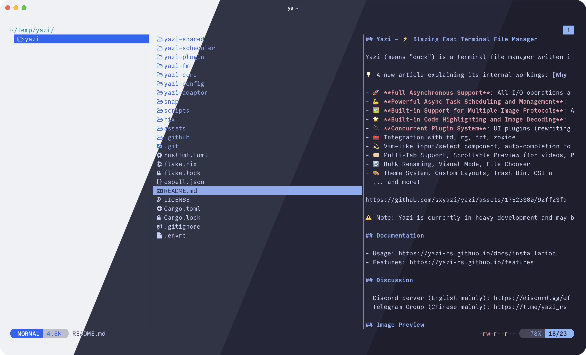
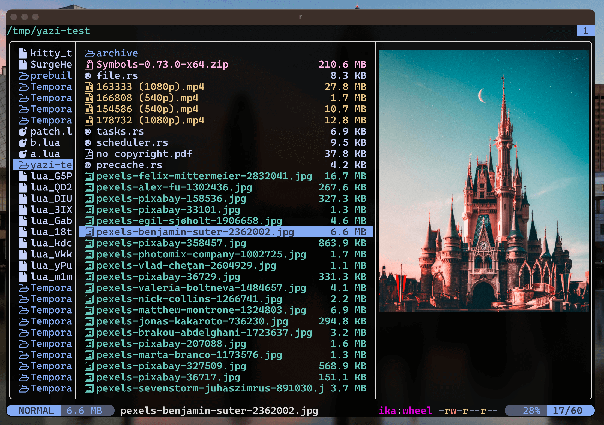
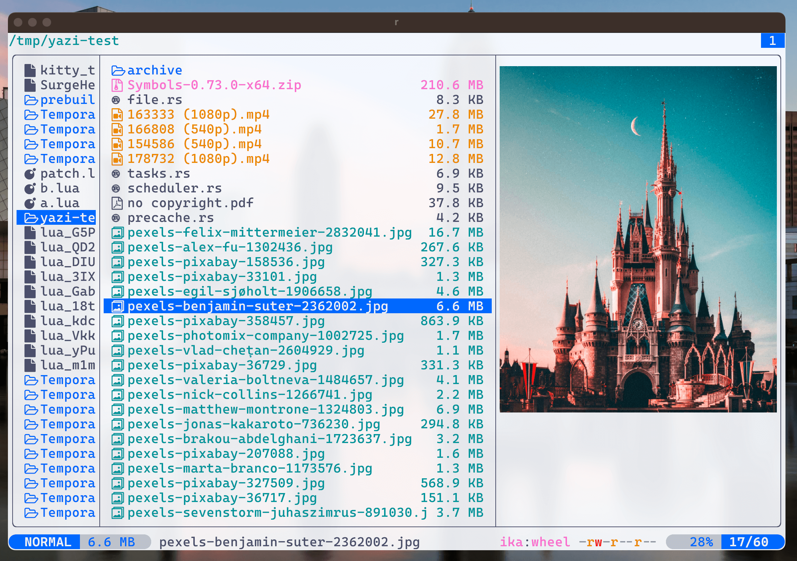
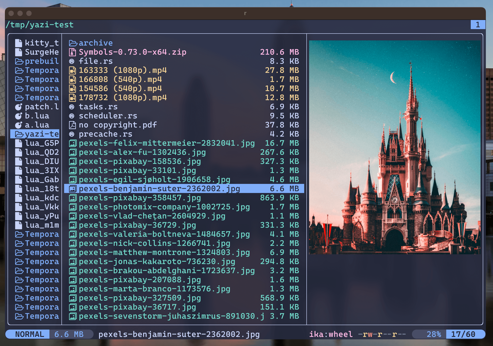

<h3 align="center">
	<br/>
	
	Catppuccin for <a href="https://yazi-rs.github.io">Yazi</a>
	
</h3>

<p align="center">
	<a href="https://github.com/catppuccin/yazi/stargazers"></a>
	<a href="https://github.com/catppuccin/yazi/issues"></a>
	<a href="https://github.com/catppuccin/yazi/contributors"></a>
</p>

<p align="center">
	
</p>

## Previews

<details>
<summary>🌻 Latte</summary>

</details>
<details>
<summary>🪴 Frappé</summary>

</details>
<details>
<summary>🌺 Macchiato</summary>

</details>
<details>
<summary>🌿 Mocha</summary>

</details>

## Usage

Choose one flavor you like:

- [catppuccin-frappe.yazi](./catppuccin-frappe.yazi/)
- [catppuccin-latte.yazi](./catppuccin-latte.yazi/)
- [catppuccin-macchiato.yazi](./catppuccin-macchiato.yazi/)
- [catppuccin-mocha.yazi](./catppuccin-mocha.yazi/)

For example, `catppuccin-mocha.yazi`, download and copy this folder as:

- `~/.config/yazi/flavors/catppuccin-mocha.yazi` on Linux/macOS
- `%AppData%\yazi\config\flavors\catppuccin-mocha.yazi` on Windows

Then add these lines to your `theme.toml` configuration file to use it:

```toml
[flavor]
use = "catppuccin-mocha"
```

## 💝 Thanks to

- [uncenter](https://github.com/uncenter)

&nbsp;

<p align="center">
	
</p>

<p align="center">
	Copyright &copy; 2021-present <a href="https://github.com/catppuccin" target="_blank">Catppuccin Org</a>
</p>

<p align="center">
	<a href="https://github.com/catppuccin/catppuccin/blob/main/LICENSE"></a>
</p>
