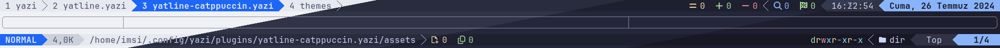
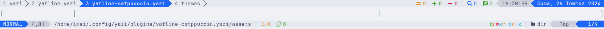
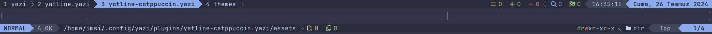
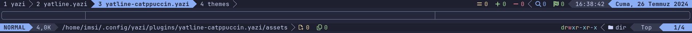
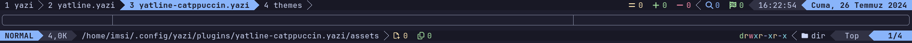

<h3 align="center">
	<br/>
	
	Catppuccin for <a href="https://github.com/imsi32/yatline.yazi">Yatline</a>
	
</h3>

<p align="center">
	<a href="https://github.com/imsi32/yatline-catppuccin.yazi/stargazers"></a>
	<a href="https://github.com/imsi32/yatline-catppuccin.yazi/issues"></a>
	<a href="https://github.com/imsi32/yatline-catppuccin.yazi/contributors"></a>
</p>

<p align="center">
	
</p>

## Previews

<details>
<summary>🌻 Latte</summary>
  	
</details>
<details>
<summary>🪴 Frappé</summary>
    	
</details>
<details>
<summary>🌺 Macchiato</summary>
    	
</details>
<details>
<summary>🌿 Mocha</summary>
    	
</details>


## Installation

### General
1) Download the `yatline-catppuccin.yazi` directory.
2) Open the plugins directory of Yazi. (In Linux: `~/.config/yazi/plugins`)
3) Copy `yatline-catppuccin.yazi` directory into `plugins` directory.
4) Create `init.lua` file in the main Yazi config directory.
5) Follow the usage steps.

## Usage
Copy the following config to the `init.lua` file.
``` lua
local catppuccin_theme = require("yatline-catppuccin"):setup("mocha") -- or "latte" | "frappe" | "macchiato"
```
Then use the `theme` variable in Yatline config's theme paramater.
``` lua
require("yatline"):setup({
-- ===

	theme = catppuccin_theme,

-- ===
})
```

## Supported Plugins
- [yatline.yazi](https://github.com/imsi32/yatline.yazi)
- [yatline-githead.yazi](https://github.com/imsi32/yatline-githead.yazi)

## 💝 Thanks to

- [imsi32](https://github.com/imsi32)

&nbsp;

<p align="center">
	
</p>

<p align="center">
	Copyright &copy; 2021-present <a href="https://github.com/catppuccin" target="_blank">Catppuccin Org</a>
</p>

<p align="center">
	<a href="https://github.com/catppuccin/catppuccin/blob/main/LICENSE"></a>
</p>
